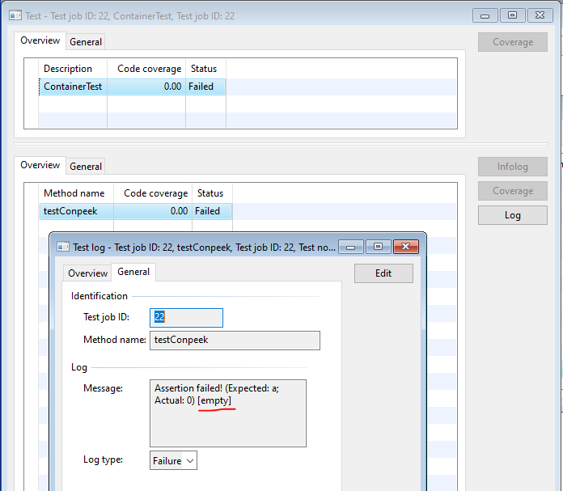
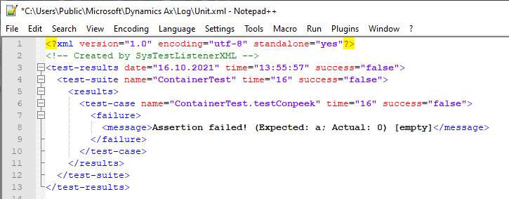

# SysTest-InfoAsTopic

[project]:https://github.com/mazzy-ax/SysTest-InfoAsTopic
[license]:https://github.com/mazzy-ax/SysTest-InfoAsTopic/blob/master/LICENSE
[ax2009]:ax2009
[ax2012]:ax2012
[ax4]:ax4

[SysTest-InfoAsTopic][project] &ndash; это минимальная модификация кода,
которая позволяет использовать почти бесполезный штатный метод `SysTestAsset.info()` для разграничения проверок
в коде одного метода.

Unit-тесты часто тестируют один и тот же метод одним и тем же способом, но с разными входными данными:
нормальные данные (happy path), граничные условия, пустые данные, null и так далее. Например:

```java
void testConpeek()
{
    container con = ['a', 2, 3.0, 01\01\2021];
    container empty;

    this.info('happy path');

    this.assertEquals('a', conpeek(con, 1));
    this.assertEquals(2,   conpeek(con, 2));
    this.assertEquals(3.0, conpeek(con, 3));

    this.info('out of bound');

    this.assertEquals(0, conpeek(con, 0));
    this.assertEquals(0, conpeek(con, 5));
    this.assertEquals(0, conpeek(con, -1));

    this.info('empty');

    this.assertEquals(0,   conpeek(empty, 0));
    this.assertEquals(0,   conpeek(empty, -1));
    this.assertEquals('a', conpeek(empty, 1));  // тест не сработает, сообщение попадет в лог
}
```

[Штатная методика](https://docs.microsoft.com/en-us/visualstudio/test/unit-test-basics)
рекомендует использовать паттерн AAA (Arrange, Act, Assert) и писать отдельный метод для каждого набора данных.
Но как мы видим в примере, создавать много однотипных методов не слишком удобно.
А главное, возникает риск забыть сделать какие-то правки в некоторых методах.

Да, штатные сообщения об ошибке в логе позволят отличить тестовые методы с разными ожидаемыми результатами.
Да, штатные сообщения, записанные в базу данных, запоминают и номер строки в исходном коде.
Да, программист может добавить какую-нибудь строку последним параметром в assert-метод.
И эта строка позволит идентифицировать какой именно assert не сработал.
Но В целом, это не очень практично.

В примере можно увидеть как предлагается использовать штатный метод `info` в качестве разделителя групп проверок.
Если импортировать данный проект на Аксапту, то к каждой строке с assert-ошибками будет добавлен текст из info.

Результат выполнения примера будет выглядеть следующим образом:

* infolog:
  

* log в базе данных:
  

* log в текстовом файле:
  

* log в xml-файле:
  

## Unit-тесты в Open Source проектах для классических Аксапт

В open source проектах для классических Аксапт постоянно приходится думать как предоставить unit-тесты,
которые могут использовать все желающие (даже если у них не модифицирован движок тестирования),
но при этом не убиться самому об неудобства штатного движка при подготовке к публикации.

Данный проект содержит новый метод `parmTopic`. Этот новый метод отлично реализует хотелку и не вмешивается в поведение
остальных методов. Однако новый метод нельзя использовать в test-методах в других open source проектах,
поскольку пользователи других open source проектов получат ошибки компиляции.

Поэтому в своих open source проектах я буду использовать метод `info` в качестве разделителя групп тестов (как продемонстрировано выше).
Те пользователи, которые импортируют этот проект, получат дополнительную информацию в логах и логичное поведение метода `info`.
Остальные смогут нормально использовать штатный движок unit-тестов в штатном режиме.

Призываю остальных авторов открытых проектов для классических Аксапт использовать метод `info` так же.

## Прочее

* проект сознательно сделан для классических версий Аксапты
* в проекте сознательно не используется xmldocs
* README и комментарии сознательно сделаны на русском языке
* код в xpp-файлах конвертирован из xpo только для удобства использования человеком. Оригиналом является код в xpo-проектах, отличия между xpo и xpp всегда трактуются в пользу текста из xpo-проектов.

## ChangeLog

* [CHANGELOG.md](CHANGELOG.md)
* <https://github.com/mazzy-ax/SysTest-InfoAsTopic/releases>

## Помощь проекту

Буду признателен вашим замечания, предложения и советы по проекту в разделе [Issues](https://github.com/mazzy-ax/SysTest-InfoAsTopic/issues).

Мазуркин Сергей (mazzy)
